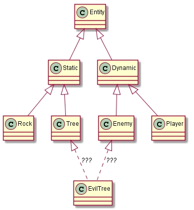
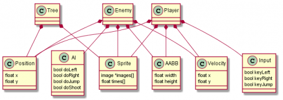

:title: Entity-Component-Systems
:author: Christopher Arndt
:date: 2016-01-13
:description: Einführung in Entity Component Systems
:keywords: presentation, restructuredtext, ECS, entity component systems

Entity-Component-Systems
------------------------

Folien & Beispiele:
    http://github.com/SpotlightKid/talk-ecs-pycologne

----

Was bedeutet Entity-Component-Systems?
--------------------------------------

* Strukturelles (architektonisches) Entwurfsmuster
* Zur Entkoppelung von Objekten
* Trennung von Objektidentität, Daten und Verhalten
* Datengesteuerte Programmlogik

----

Das Problem
-----------

* Objektorientierter Ansatz führt bei Spielen oft zu Problemen mit der
  Klassenhierarchie.
* Game-Objekte haben die Tendenz, aufgebläht zu werden und zu eng mit
  den anderen Programmteilen gekoppelt zu sein.
* Änderungen des Verhaltens von Game-Objekten machen oft Änderungen an vielen
  Stellen des Codes notwendig.

----

Problematische Klassenhierchie
------------------------------

----

Bestandteile eines ECS
-----------------------

* Entitäten *(Entities)*
* Komponenten *(Components)*
* Systeme *(Systems, Processors)*
* Welt *(World)*

----

Entitäten
---------

* Sind nur ein *Unique Identifier*
* Enthalten keine Daten
* Werden in der *World*-Datenbank gespeichert
* Können einfache *Integer* sein

----

Komponenten
------------

* Sind reine Datencontainer
* Enthalten keine oder kaum Programmlogik
* Sind unabhängig von anderen Komponenten
* Als *Struct* oder einfache Klasse nur mit datenattributen implementiert

----

Entities und Components
-----------------------

----

Systeme
-------

* Wirken auf die Entitäten, die eine bestimmte Menge von Komponenten haben
* Iterieren in jedem Simulationsschritt über alle diese Entitäten
* Verändern ggf. die Komponentendaten und/oder lösen aufgrund dieser bestimmte
  Aktionen aus
* Z.B. Veränderung der Position eines Objekts auf Basis seiner Geschwindigkeit,
  Senden einer Nachricht and Event Listener bei Kollisionen, usw.

----

Welt
----

* Bildet die Datenbank der vorhandenen *Entitäten*
* Verknüpft diese mit *Komponenten*
* Enthält alle *Systeme*, die auf die Entitäten und Komponenten wirken
* Ruft alle Systeme der Reihe nach in jeder Iteration der Simulation auf

----

esper
-----

* Python-Bibliothek zur Implementierung von ECS
* Unabhängig von der benutzten Grafik- oder Gamebibliothek
* Python 3 (inoffizieller Python 2 Branch)

Auf Github:
    https://github.com/benmoran56/esper

----

Danke für die Aufmerksamkeit!
-----------------------------

Slides:
    http://github.com/SpotlightKid/talk-ecs-pycologne

Python-Programmierung & Open Source/Linux-Beratung
~~~~~~~~~~~~~~~~~~~~~~~~~~~~~~~~~~~~~~~~~~~~~~~~~~

**Suche Aufträge!**

chris@chrisarndt.de
0176-28259175

